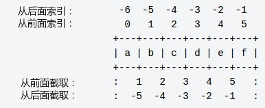

## Python3字符串

&emsp;&emsp;字符串是Python中最常用的数据类型。我们可以<font color="red">使用引号
(`'`或`"`)来创建字符串，创建字符串很简单，只要为变量分配一个值即可</font>。例如：

```python
var1 = 'Hello World!'
var2 = "Runoob"
```

### Python字符串操作

&emsp;&emsp;<font color="red">Python不支持单字符类型，单字符在Python中也是作为一个字符串
使用</font>。

&emsp;&emsp;P<font color="red">ython可以使用方括号来截取字符串</font>，字符串的截取的语
法格式如下：  

```sh
变量[头下标:尾下标]
```

<font color="red">索引值以0为开始值，-1为从末尾的开始位置</font>。

<div align=center></div>

```sh
>>>word = 'Python'
>>> print(word[0], word[5])
P n
>>> print(word[-1], word[-6])
n P
```

&emsp;&emsp;与C字符串不同的是，<font color="red">Python字符串不能被改变</font>。向一个
索引位置赋值，比如`word[0] = 'm'`会导致错误。

### Python转义字符

&emsp;&emsp;<font color="red">Python使用反斜杠(\\)转义特殊字符，如果你不想让反斜杠发生转
义，可以在字符串前面添加一个`r`，表示原始字符串</font>。

```sh
>>> print('Ru\noob')
Ru
oob
>>> print(r'Ru\noob')
Ru\noob
```

<table>
<tr><th>转义字符</th><th>描述</th></tr>
<tr><td>\(在行尾时)</td><td>续行符</td></tr>
<tr><td>\\</td><td>反斜杠符号</td></tr>
<tr><td>\'</td><td>单引号</td></tr>
<tr><td>\"</td><td>双引号</td></tr>
<tr><td>\a</td><td>响铃</td></tr>
<tr><td>\b</td><td>退格</td></tr>
<tr><td>\e</td><td>转义</td></tr>
<tr><td>\0</td><td>空</td></tr>
<tr><td>\n</td><td>换行</td></tr>
<tr><td>\v</td><td>纵向制表符</td></tr>
<tr><td>\t</td><td>横向制表符</td></tr>
<tr><td>\r</td><td>回车</td></tr>
<tr><td>\f</td><td>换页</td></tr>
<tr><td>\oyy</td><td>八进制数，yy代表的字符，例如：\o12代表换行</td></tr>
<tr><td>\xyy</td><td>十六进制数，yy代表的字符，例如：\x0a代表换行</td></tr>
<tr><td>\other</td><td>其它的字符以普通格式输出</td></tr>
</table>

### Python字符串运算符

&emsp;&emsp;下表实例变量a值为字符串"Hello"，b变量值为"Python"：

<table>
<tr>
<th>操作符</th>
<th>描述</th>
<th>实例</th>
</tr>
<tr>
<td>+</td>
<td>字符串连接</td>
<td><code>a + b</code>输出结果：HelloPython</td>
</tr>
<tr>
<td>*</td>
<td>重复输出字符串</td>
<td><code>a * 2</code>输出结果：HelloHello</td>
</tr>
<tr>
<td>[]</td>
<td>通过索引获取字符串中字符</td>
<td><code>a[1]</code>输出结果：e</td>
</tr>
<tr>
<td>[:]</td>
<td>截取字符串中的一部分，遵循左闭右开原则，<code>str[0, 2]</code>是不包含第3个字符的</td>
<td>`a[1:4]`输出结果ell</td>
</tr>
<tr>
<td>in</td>
<td>成员运算符 - 如果字符串中包含给定的字符返回True</td>
<td>`'H' in a`输出结果True</td>
</tr>
<tr>
<td>not in</td>
<td>成员运算符 - 如果字符串中不包含给定的字符返回True</td>
<td>`'M' not in a`输出结果True</td>
</tr>
<tr>
<td>r/R</td>
<td>原始字符串 - 所有的字符串都是直接按照字面的意思来使用，没有转义特殊或不能打印的字符</td>
<td>print(r'\n')</td>
</tr>
<tr>
<td>%</td>
<td>格式字符串</td>
<td>请看下一节内容</td>
</tr>
</table>

```python
a = 'Hello'
b = 'Python'

print('a + b输出结果：', a + b)
print('a * 2输出结果：', a * 2)
print('a[1]输出结果：', a[1])
print('a[1:4]输出结果：', a[1:4])

if('H' in a) :
    print('H在变量a中')
else :
    print('H不在变量a中')

if('M' not in a) :
    print('M不在变量a中')
else :
    print('M在变量a中')

print(r'\n')
print(R'\n')
```

以上实例输出结果为：

```sh
a + b输出结果：HelloPython
a * 2输出结果：HelloHello
a[1]输出结果：e
a[1:4]输出结果：ell
H在变量a中
M不在变量a中
\n
\n
```

### Python字符串格式化

&emsp;&emsp;Python支持格式化字符串的输出。尽管这样可能会用到非常复杂的表达式，但最基本
的用法是将一个值插入到一个有字符串格式符`%s`的字符串中。

&emsp;&emsp;<font color="red">在Python中，字符串格式化使用与C中sprintf函数一样的语法</font>。

```python
print('我叫%s, 今年%d岁!' % ('小明', 10))
```

以上实例输出结果：

```sh
我叫小明, 今年10岁!
```

python字符串格式化符号:

<table>
<tr><th>符号</th><th>描述</th></tr>
<tr><td>%c</td><td>格式化字符及其ASCII码。</td></tr>
<tr><td>%s</td><td>格式化字符串。</td></tr>
<tr><td>%d</td><td>格式化整数。</td></tr>
<tr><td>%u</td><td>格式化无符号整型。</td></tr>
<tr><td>%o</td><td>格式化无符号八进制数。</td></tr>
<tr><td>%x</td><td>格式化无符号十六进制数。</td></tr>
<tr><td>%X</td><td>格式化无符号十六进制数(大写)。</td></tr>
<tr><td>%f</td><td>格式化浮点数字，可指定小数点后的精度。</td></tr>
<tr><td>%e</td><td>用科学计数法格式化浮点数。</td></tr>
<tr><td>%E</td><td>作用同%e，用科学计数法格式化浮点数。</td></tr>
<tr><td>%g</td><td>%f和%e的简写。</td></tr>
<tr><td>%G</td><td>%f和%E的简写。</td></tr>
<tr><td>%p</td><td>用十六进制数格式化变量的地址。</td></tr>
</table>

格式化操作符辅助指令:

<table>
<tr>
<th>符号</th>
<th>功能</th>
</tr>
<tr>
<td>*</td>
<td>定义宽度或者小数点精度。</td>
</tr>
<tr>
<td>-</td>
<td>用做左对齐。</td>
</tr>
<tr>
<td>+</td>
<td>在正数前面显示加号(+)。</td>
</tr>
<tr>
<td><sp></td>
<td>在正数前面显示空格。</td>
</tr>
<tr>
<td>#</td>
<td>在八进制数前面显示零('0')，在十六进制前面显示'0x'或者'0X'(取决于用的是'x'还是'X')。</td>
</tr>
<tr>
<td>0</td>
<td>显示的数字前面填充'0'而不是默认的空格。</td>
</tr>
<tr>
<td>%</td>
<td>'%%'输出一个单一的'%'。</td>
</tr>
<tr>
<td>(var)</td>
<td>映射变量(字典参数)。</td>
</tr>
<tr>
<td>m.n</td>
<td>m是显示的最小总宽度, n是小数点后的位数(如果可用的话)。</td>
</tr>
</table>

&emsp;&emsp;Python2.6开始，新增了一种格式化字符串的函数str.format()，它增强了字符串格式化
的功能。

### Python三引号

&emsp;&emsp;<font color="red">Python三引号允许一个字符串跨多行，字符串中可以包含换行符、
制表符以及其他特殊字符</font>。
实例如下：

```python
para_str = """
这是一个多行字符串的实例多行
字符串可以使用制表符TAB(\t)。
也可以使用换行符[\n]。
"""

print(para_str)
```

以上实例执行结果为：

```sh
这是一个多行字符串的实例多行
字符串可以使用制表符TAB(   )。
也可以使用换行符[
]。
 ```

 &emsp;&emsp;三引号让程序员从引号和特殊字符串的泥潭里面解脱出来，自始至终保持一小块字
 符串的格式是所谓的WYSIWYG(所见即所得)格式的。

&emsp;&emsp;一个典型的用例是，当你需要一块HTML或者SQL时，这时用字符串组合，特殊字符串
转义将会非常的繁琐。

```python
errHTML = '''
<HTML><HEAD><TITLE>
Friends CGI Demo</TITLE></HEAD>
<BODY><H3>ERROR</H3>
<B>%s</B><P>
<FORM><INPUT TYPE=button VALUE=Back
ONCLICK="window.history.back()"></FORM>
</BODY></HTML>
'''

cursor.execute('''
CREATE TABLE users (
login VARCHAR(8),
uid INTEGER,
prid INTEGER)
''')
```

### Unicode字符串

&emsp;&emsp;在Python2中，普通字符串是以8位ASCII码进行存储的，而Unicode字符串则存储为16位
unicode字符串，这样能够表示更多的字符集。使用的语法是在字符串前面加上前缀`u`。  
&emsp;&emsp;<font color="red">在Python3中，所有的字符串都是Unicode字符串</font>。  

### Python的字符串内建函数

Python 的字符串常用内建函数如下：

<table>
<tr>
<th>序号</th>
<th>方法</th>
<th>描述</th>
</tr>
<tr>
<td>1</td>
<td>capitalize()</td>
<td>将字符串的第一个字符转换为大写。</td>
</tr>
<tr>
<td>2</td>
<td>center(width, fillchar)</td>
<td>返回一个指定的宽度width居中的字符串，fillchar为填充的字符，默认为空格。</td>
</tr>
<tr>
<td>3</td>
<td>count(str, beg= 0, end=len(string))</td>
<td>返回str在string里面出现的次数，如果beg或者end指定则返回指定范围内str出现的次数。</td>
</tr>
<tr>
<td>4</td>
<td>bytes.decode(encoding=‘utf-8’, errors=‘strict’)</td>
<td>Python3中没有decode方法，但我们可以使用bytes对象的decode()方法来解码给定的bytes对象，
这个bytes对象可以由str.encode()来编码返回。</td>
</tr>
<tr>
<td>5</td>
<td>encode(encoding='utf-8', errors='strict')</td>
<td>以encoding指定的编码格式编码字符串，如果出错默认报一个ValueError的异常，除非errors指定
的是'ignore'或者'replace'。</td></tr>
<tr>
<td>6</td>
<td>endswith(suffix, beg=0, end=len(string))</td>
<td>检查字符串是否以obj结束，如果beg或者end指定则检查指定的范围内是否以obj结束，如果是，返回
True，否则返回False。</td>
</tr>
<tr>
<td>7</td>
<td>expandtabs(tabsize=8)</td>
<td>把字符串string中的tab符号转为空格，tab符号默认的空格数是8。</td>
</tr>
<tr>
<td>8</td>
<td>find(str, beg=0 end=len(string))</td>
<td>检测str是否包含在字符串中，如果指定范围beg和end，则检查是否包含在指定范围内，如果包含返回
开始的索引值，否则返回-1。</td>
</tr>
<tr>
<td>9</td>
<td>index(str, beg=0, end=len(string))</td>
<td>跟find()方法一样，只不过如果str不在字符串中会报一个异常。</td>
</tr>
<tr>
<td>10</td>
<td>isalnum()</td>
<td>如果字符串至少有一个字符并且所有字符都是字母或数字则返回True,否则返回False。</td>
</tr>
<tr>
<td>11</td>
<td>isalpha()</td>
<td>如果字符串至少有一个字符并且所有字符都是字母则返回True, 否则返回False。</td>
</tr>
<tr>
<td>12</td>
<td>isdigit()</td>
<td>如果字符串只包含数字则返回True，否则返回False。</td>
</tr>
<tr>
<td>13</td>
<td>islower()</td>
<td>如果字符串中包含至少一个区分大小写的字符，并且所有这些(区分大小写的)字符都是小写，则返回
True，否则返回False。</td>
</tr>
<tr>
<td>14</td>
<td>isnumeric()</td>
<td>如果字符串中只包含数字字符，则返回True，否则返回False。</td>
</tr>
<tr>
<td>15</td>
<td>isspace()</td>
<td>如果字符串中只包含空白，则返回True，否则返回False。</td>
</tr>
<tr>
<td>16</td>
<td>istitle()</td>
<td>如果字符串是标题化的(见title())则返回True，否则返回False。</td>
</tr>
<tr>
<td>17</td>
<td>isupper()</td>
<td>如果字符串中包含至少一个区分大小写的字符，并且所有这些(区分大小写的)字符都是大写，则返回
True，否则返回False。</td>
</tr>
<tr>
<td>18</td>
<td>join(seq)</td>
<td>以指定字符串作为分隔符，将seq中所有的元素(的字符串表示)合并为一个新的字符串。</td>
</tr>
<tr>
<td>19</td>
<td>len(string)</td>
<td>返回字符串长度。</td>
</tr>
<tr>
<td>20</td>
<td>ljust(width[, fillchar])</td>
<td>返回一个原字符串左对齐,并使用fillchar填充至长度width的新字符串，fillchar默认为空格。</td>
</tr>
<tr>
<td>21</td>
<td>lower()</td>
<td>转换字符串中所有大写字符为小写。</td>
</tr>
<tr>
<td>22</td>
<td>lstrip()</td>
<td>截掉字符串左边的空格或指定字符</td>
</tr>
<tr>
<td>23</td>
<td>maketrans()</td>
<td>创建字符映射的转换表，对于接受两个参数的最简单的调用方式，第一个参数是字符串，表示需要转换
的字符，第二个参数也是字符串表示转换的目标。</td>
</tr>
<tr>
<td>24</td>
<td>max(str)</td>
<td>返回字符串str中最大的字母。</td>
</tr>
<tr>
<td>25</td>
<td>min(str)</td>
<td>返回字符串str中最小的字母。</td>
</tr>
<tr>
<td>26</td>
<td>replace(old, new [, max])</td>
<td>将字符串中的str1替换成str2, 如果max指定，则替换不超过max次。</td>
</tr>
<tr>
<td>27</td>
<td>rfind(str, beg=0,end=len(string))</td>
<td>类似于find()函数，不过是从右边开始查找。</td>
</tr>
<tr>
<td>28</td>
<td>rindex( str, beg=0, end=len(string))</td>
<td>类似于index()，不过是从右边开始。</td>
</tr>
<tr>
<td>29</td>
<td>rjust(width,[, fillchar])</td>
<td>返回一个原字符串右对齐,并使用`fillchar`(默认空格)填充至长度width的新字符串。</td>
</tr>
<tr>
<td>30</td>
<td>rstrip()</td>
<td>删除字符串字符串末尾的空格。</td>
</tr>
<tr>
<td>31</td>
<td>split(str="", num=string.count(str))</td>
<td><code>num=string.count(str))</code>以str为分隔符截取字符串，如果num有指定值，
则仅截取num+1个子字符串。</td>
</tr>
<tr>
<td>32</td>
<td>splitlines([keepends])</td>
<td>按照行('\r', '\r\n', \n')分隔，返回一个包含各行作为元素的列表，如果参数keepends为
False，不包含换行符，如果为True，则保留换行符。</td>
</tr>
<tr>
<td>33</td>
<td>startswith(substr, beg=0, end=len(string))</td>
<td>检查字符串是否是以指定子字符串substr开头，是则返回True，否则返回False。如果beg和end
指定值，则在指定范围内检查。</td>
</tr>
<tr>
<td>34</td>
<td>strip([chars])</td>
<td>在字符串上执行lstrip()和rstrip()。</td>
</tr>
<tr>
<td>35</td>
<td>swapcase()</td>
<td>将字符串中大写转换为小写，小写转换为大写。</td>
</tr>
<tr>
<td>36</td>
<td>title()</td>
<td>返回"标题化"的字符串,就是说所有单词都是以大写开始，其余字母均为小写(见istitle())。</td>
</tr>
<tr>
<td>37</td>
<td>translate(table, deletechars='')</td>
<td>根据str给出的表(包含256个字符)转换string的字符，要过滤掉的字符放到deletechars参数中。</td>
</tr>
<tr>
<td>38</td>
<td>upper()</td><
td>转换字符串中的小写字母为大写。</td>
</tr>
<tr>
<td>39</td>
<td>zfill(width)</td>
<td>返回长度为width的字符串，原字符串右对齐，前面填充0。</td>
</tr>
<tr>
<td>40</td>
<td>isdecimal()</td>
<td>检查字符串是否只包含十进制字符，如果是返回True，否则返回False。</td>
</tr>
</table>