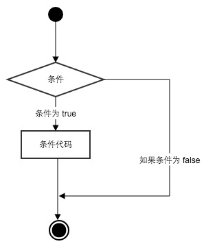

## Python3条件语句

&emsp;&emsp;Python条件语句是通过一条或多条语句的执行结果(`True`或者`False`)来决定执行的代
码块。可以通过下图来简单了解条件语句的执行过程:

<div align=center></div>

### if语句

&emsp;&emsp;Python中if语句的一般形式如下所示：

```python
if 表达式1:
    代码块1
elif 表达式2:
    代码块2
else:
    代码块3
```

- 如果“表达式1”为`True`将执行“代码块1”块语句；
- 如果“表达式1”为`False`，将判断“表达式2”；
- 如果“表达式2”为`True`将执行“代码块2”块语句；
- 如果“表达式2”为`False`，将执行“代码块3”块语句；

<font color="red">Python中用`elif`代替了`else if`，所以if语句的关键字为：
`if – elif – else`</font>。

**注意**：

1. <font color="red">每个条件后面要使用冒号`:`，表示接下来是满足条件后要执行的语句块</font>。
2. <font color="red">使用缩进来划分语句块，相同缩进数的语句在一起组成一个语句块</font>。
3. <font color="red">在Python中没有`switch – case`语句</font>。

### 实例

&emsp;&emsp;以下是一个简单的if实例：

```python
var1 = 100
if var1:
    print('1 - if表达式条件为True')
    print(var1)

var2 = 0
if var2:
    print('2 - if表达式条件为True')
    print(var2)

print('Good bye!')
```

执行以上代码，输出结果为：

```sh
1 - if表达式条件为True
100
Good bye!
```

从结果可以看到由于变量var2为0，所以对应的`if`内的语句没有执行。

&emsp;&emsp;以下实例演示了狗的年龄计算判断：

```python
# -*- coding: utf-8 -*-
# filename: test.py

age = int(input('请输入你家狗狗的年龄:'))
if age < 0:
    print('你是在逗我吧!')
elif age == 1:
    print('相当于14岁的人。')
elif age == 2:
    print('相当于22岁的人。')
elif age > 2:
    human = 22 + (age -2) * 5
    print('对应人类年龄:', human)

# 退出提示
input('点击enter键退出!')
```

执行以上脚本，输出结果如下：

```sh
$ python3 test.py
请输入你家狗狗的年龄: 1

相当于14岁的人。
点击enter键退出
```

&emsp;&emsp;以下实例演示了数字猜谜游戏：

```python
# -*- coding: utf-8 -*-
# filename: test.py

number = 7
guess = -1
print('数字猜谜游戏开始...')
while guess != number:
    guess = int(input('请输入你猜的数字：'))
    if guess == number:
        print('恭喜，你猜对了！')
    elif guess < number:
        print('猜的数字小了...')
    elif guess > number:
        print('猜的数字大了...')
```

执行以上脚本，输出结果如下：

```sh
$ python3 test.py
数字猜谜游戏!
请输入你猜的数字：1
猜的数字小了...
请输入你猜的数字：9
猜的数字大了...
请输入你猜的数字：7
恭喜，你猜对了！
```

### if嵌套

&emsp;&emsp;在嵌套if语句中，可以把`if ... elif ... else`结构放在另外一个
`if ... elif ... else`结构中。

```python
if 表达式1:
    代码块1
    if 表达式2:
        代码块2
    elif 表达式3:
        代码块3
    else:
        代码块4
elif 表达式4:
    代码块5
else:
    代码块6
```

 ```python
 # -*- coding: utf-8 -*-
# filename: test.py

num=int(input('输入一个数字:'))
if num % 2 == 0:
    if num % 3 == 0:
        print('你输入的数字可以整除2和3')
    else:
        print('你输入的数字可以整除2，但不能整除3')
else:
    if num % 3 == 0:
        print('你输入的数字可以整除3，但不能整除2')
    else:
        print('你输入的数字不能整除2和3')
```

执行以上脚本，输出结果如下：

```sh
$ python3 test.py
输入一个数字：6
你输入的数字可以整除2和3
```