## Python培训项目

### 本地安装Git

1. 下载Git安装包

&emsp;&emsp;Git下载地址：[https://git-scm.com/downloads](https://git-scm.com/downloads)

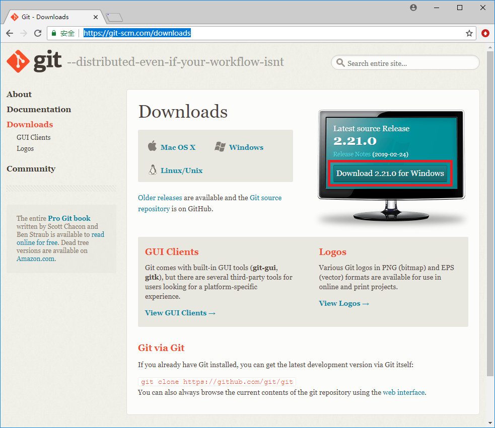

2. 本地安装Git

&emsp;&emsp;双击`Git-2.14.0.2-64-bit.exe`打开，按照提示一步一步操作，即可完成安装。

3. Git安装验证

```sh
$ git --version
git version 2.21.0.windows.1
```

### 本地安装RBTools

1. 下载RBTools安装包

RBTools下载地址：[https://downloads.reviewboard.org/releases/RBTools/1.0/index.html](https://downloads.reviewboard.org/releases/RBTools/1.0/index.html)

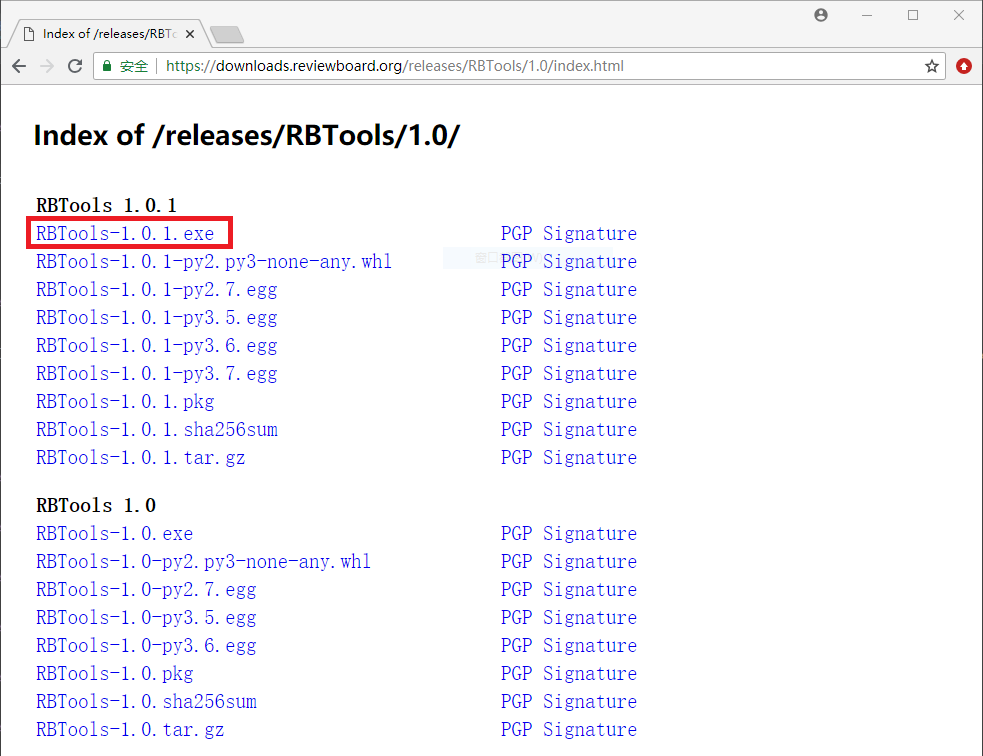

2. 本地安装RBTools

&emsp;&emsp;双击`RBTools-1.0.1.exe`打开，按照提示一步一步操作，即可完成安装。

3. RBTools安装验证

```sh
$ rbt --version
RBTools 1.0.1
```

### 生成SSH Key

打开`git-bash.exe`窗口:

```sh
# 生成SSH Key
$ ssh-keygen -t rsa -C "ranzhen@beyondsoft.com"

# 查看SSH Key
$ cat /c/Users/Administrator/.ssh/id_rsa.pub
```

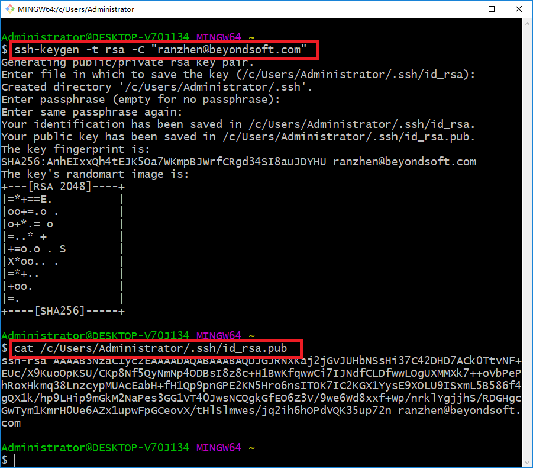

### GitLab注册

1. 使用浏览器打开[GitLab注册页面](http://10.100.15.200/users/sign_in)

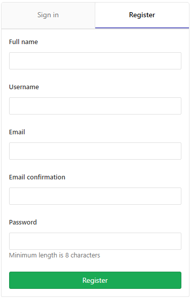

2. 填写姓名、账号、邮箱、密码等信息，注册新账号。

### 添加SSH Key

1. 使用浏览器打开[GitLab](http://10.100.15.200/)，输入用户名和密码登录。  
2. 打开右上角用户图标-->“设置”页面。  
3. 在左边导航栏选择“SSH密钥”，打开“SSH密钥”页面。  
4. 复制SSH KEY公钥(.ssh/id_rsa.pub)的内容到“Key”文本框，点“添加密钥”完成SSH KEY添加。  

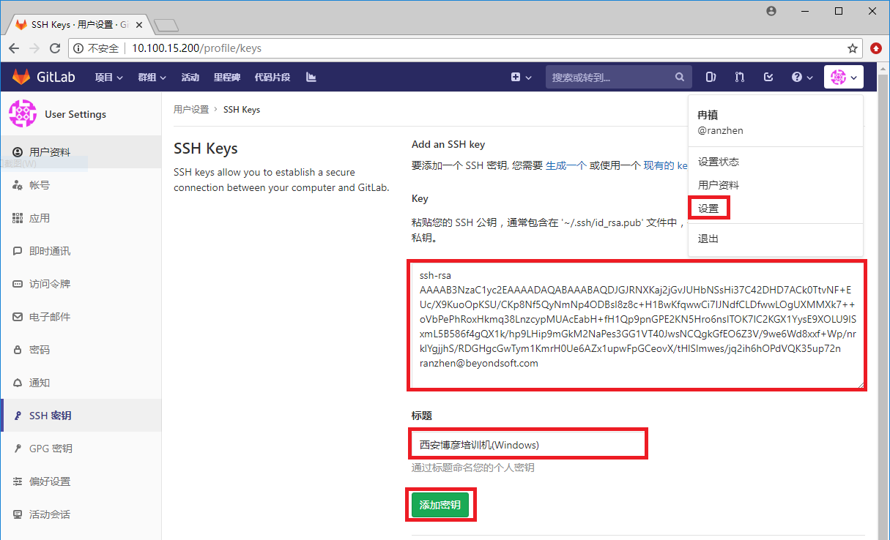

### 基于`master`创建`develop-<username>`分支

&emsp;&emsp;为了方便每位学员能够将自己的练习代码提交到GitLab，需要每位学员基于`master`分支创建自己的代码分支`develop-<username>`，其中username为自己的名称。

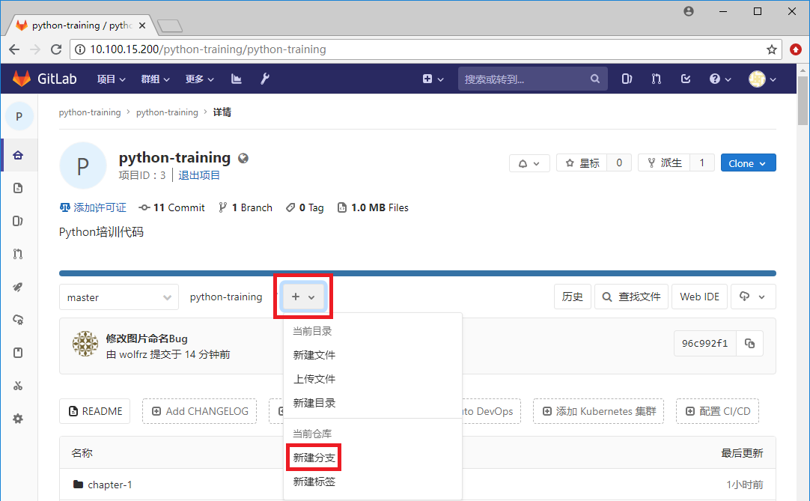
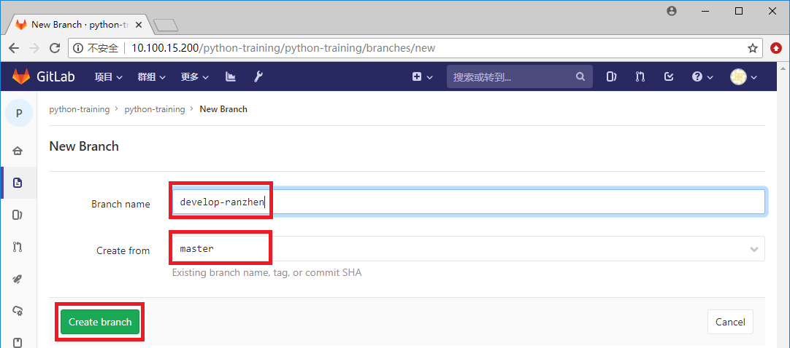
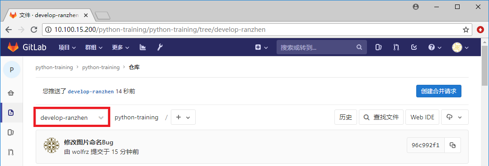

### 基于`develop-<username>`创建`training-<username>`分支

&emsp;&emsp;为了方便每位学员能够将自己的练习代码提交Review申请，需要每位学员基于`develop-<username>`分支创建自己的代码分支`training-<username>`，其中username为自己的名称。

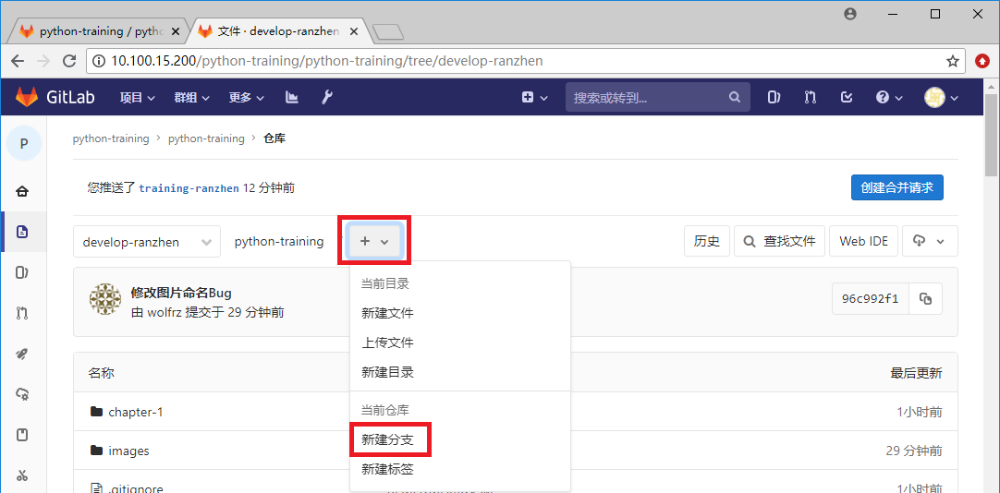
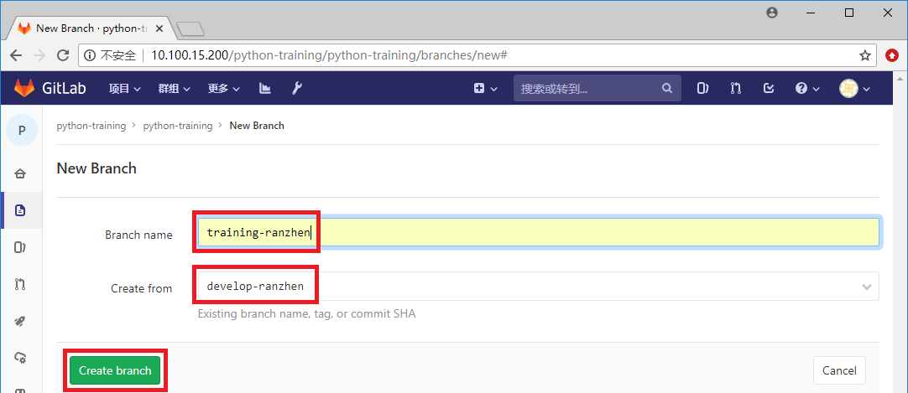
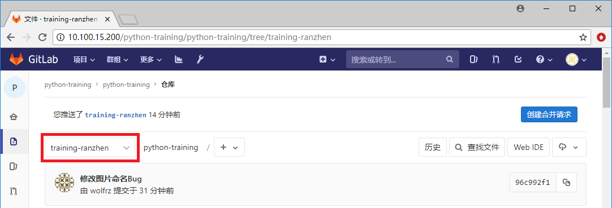

**注意**：`training-<username>`分支为平常练习分支，Review代码时，`training-<username>`分支与`develop-<username>`分支比较，生成Review信息。

### 克隆`python-training`项目

1. 获取python-training项目地址: git@10.100.15.200:python-training/python-training.git

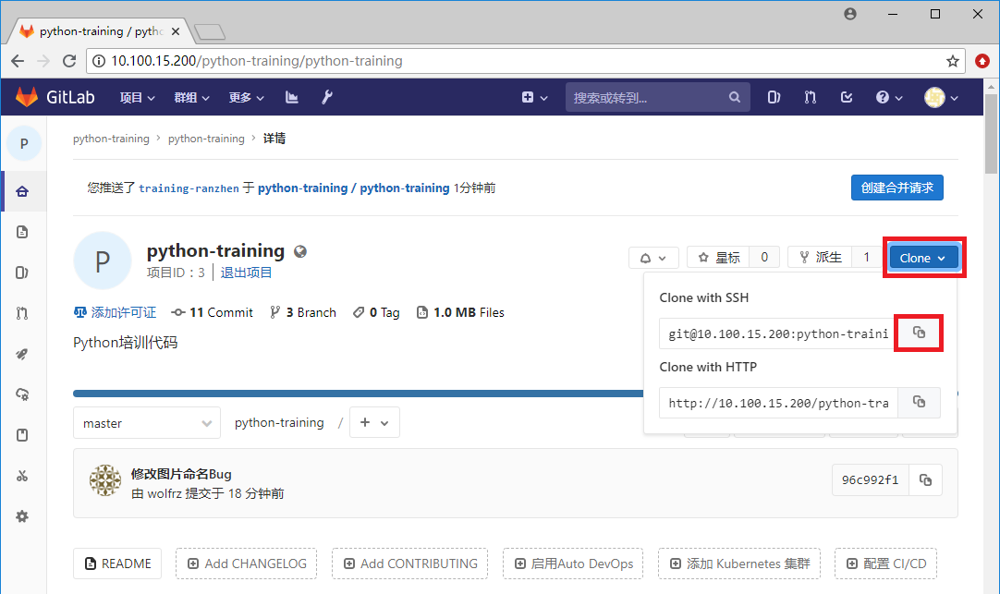

2. 克隆python-training项目的training-<username>分支到本地

```sh
$ git clone -b training-<username> git@10.100.15.200:python-training/python-training.git
```

### 编辑代码

1. 创建`chapter-1/ch1.3.py`文件。  
2. 编辑`chapter-1/ch1.3.py`文件。

```python
print('Hello Python!')
```

3. 保存`chapter-1/ch1.3.py`文件。  
4. 调试`chapter-1/ch1.3.py`文件。    

```sh
$ python ch1.3.py
Hello Python!
```

### 提交代码

```sh
$ cd /d/Project/python-training/python-training # 切换到项目根目录
$ git add chapter-1/ch1.3.py # 添加ch1.3.py到暂存区
$ git commit -m "新增ch1.3.py文件"
$ git push # 推送当前分支(training-<username>)到远程training-<username>分支
```

### ReviewBoard注册

1. 使用浏览器打开[Review Board注册页面](http://10.100.15.202/account/register/)

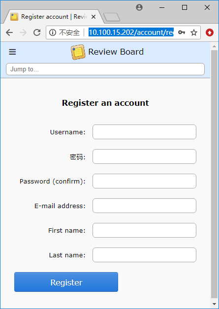

2. 填写账号、密码、邮箱、姓名等信息，注册新账号。

### 提交Review

1. 修改`.reviewboardrc`文件

```
REVIEWBOARD_URL = "http://10.100.15.202"
REPOSITORY = "git@10.100.15.200:python-training/python-training.git"
USERNAME = "<username>" # GitLab账号
PASSWORD = "<password>" # GitLab密码
TRACKING_BRANCH = "origin/develop-<username>"
```

2. 提交Review申请

&emsp;&emsp;代码开发完成以后，需要提交Review申请，供项目组内人员Review代码，并提出意见。

```sh
$ cd /d/Project/python-training/python-training # 切换到项目根目录
$ rbt post # 首次提交Review申请
```

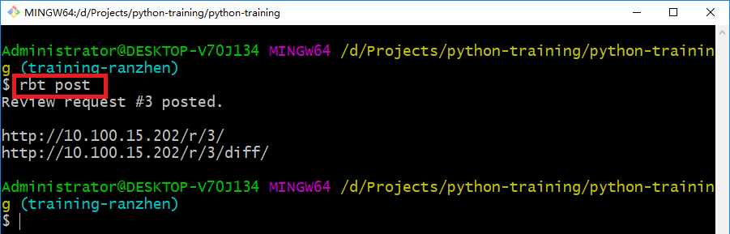

3. 查看Review申请

&emsp;&emsp;打开Review Board的[Dashboard页面](http://10.100.15.202/dashboard/)

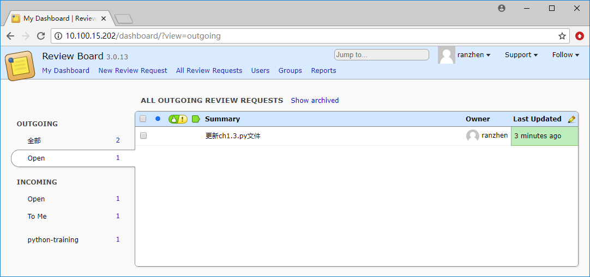

&emsp;&emsp;打开新提交的[Review请求页面](http://10.100.15.202/r/3/)

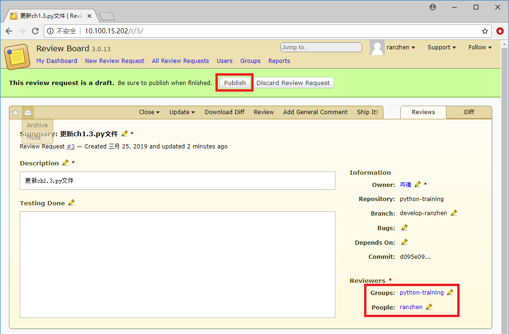

4. 更新Review申请

&emsp;&emsp;修改完成项目组内人员的Review信息后，需要重新提交Review申请，请求再次Review。

```sh
$ cd /d/Project/python-training/python-training # 切换到项目根目录
$ rbt post -g -r <review number> # 更新Review申请
```

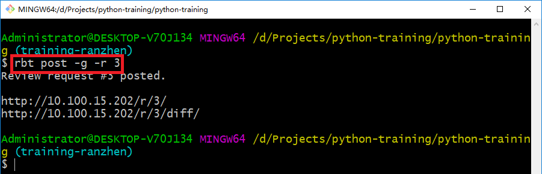

3. 查看Review申请

&emsp;&emsp;打开更新后的[Review请求页面](http://10.100.15.202/r/3/)

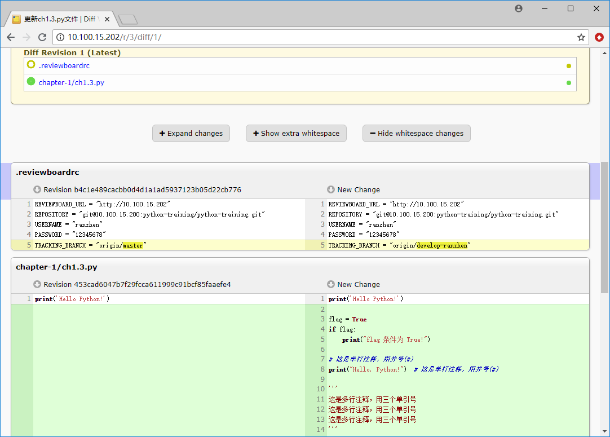

5. 合并代码

&emsp;&emsp;Review的代码被认可(Ship It)后，需要合并代码到master分支。

```sh
$ cd /d/Project/python-training/python-training # 切换到项目根目录
$ git checkout develop-<username> # 切换到develop-<username>分支
$ git merge training-<username> # 合并training-<username>的代码到当前分支(develop-<username>)分支
$ git push # 推送当前分支(develop-<username>)到远程develop-<username>分支
```


